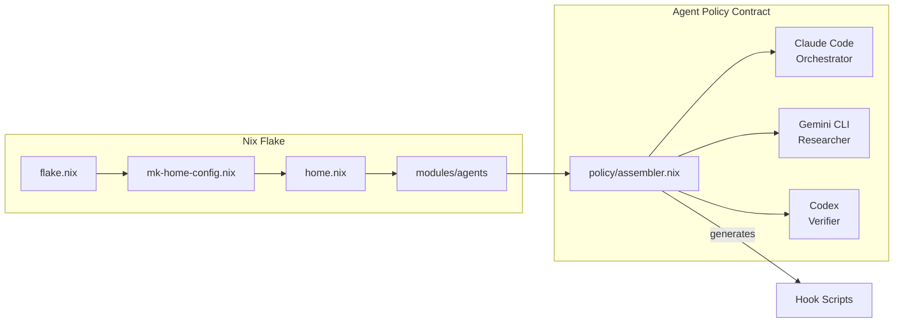

[](https://github.com/vanillacake369/tonys-nix/actions/workflows/ci.yml)
[](https://vanillacake369.github.io/tonys-nix/)
[](LICENSE)
[](https://nixos.wiki/wiki/Flakes)
[]()

# Multi-Platform Nix Configuration

A comprehensive personal Nix configuration using flakes and home-manager for multi-platform development environments, with built-in AI agent orchestration for Claude Code, Gemini CLI, and Codex.

Supports NixOS, WSL, macOS (Intel & Apple Silicon), and standard Linux distributions with automatic environment detection.

## Features

- **Multi-platform support**: NixOS, WSL, macOS, Linux -- one flake, auto-detected at apply time
- **Automated setup**: `just bootstrap` does everything from Nix installation to AI provider authentication
- **Development tools**: Go, Java, Rust, Python, Node.js, Terraform, Lua, C/C++ with LSP servers for each
- **Shell configuration**: fish + zellij + modern CLI (bat, ripgrep, fd, fzf, lazygit)
- **Editor setup**: Neovim with LazyVim configuration
- **AI agent orchestration**: Claude Code (orchestrator), Gemini CLI (researcher), Codex (verifier) with policy contracts
- **macOS productivity**: Karabiner + AeroSpace keymaps generated from a single Nix spec
- **SSD optimization**: Conditional garbage collection (age + disk pressure), 80-90% fewer write operations
- **Image generation**: Bootable ISOs, VirtualBox, VMware, and QEMU images from NixOS configuration

## Included Packages

| Category | Packages |
|---|---|
| Languages | Go, Java (Zulu 17), Rust, Python 3.13, Node.js 22, Lua 5.4, C/C++ |
| Infra & DevOps | Terraform, Ansible, AWS CLI, ngrok, nuclei |
| Nix Tooling | nixd, alejandra, statix, deadnix |
| Shell & CLI | fish, zellij, bat, ripgrep, fd, fzf, direnv, lazygit, sops, age |
| Editor | Neovim (LazyVim) + language servers for all above |
| AI Agents | Claude Code, Gemini CLI, Codex, cli-proxy-api (unified auth proxy) |
| macOS Apps | AeroSpace, Karabiner, WezTerm, AlDente, JankyBorders, Hidden Bar |
| Linux Apps | Firefox, Slack, TickTick, LibreOffice |
| JetBrains | IntelliJ, GoLand (via packages/jetbrains.hm.nix) |
| Secrets | sops, age, ssh-to-age, git-crypt, gnupg |

> **Note**: Package versions are managed by nixpkgs-unstable. Run `home-manager packages` to see current versions.

## Quick Start

### Prerequisites

- Git
- Internet connection

### One-Command Setup

```bash
git clone https://github.com/vanillacake369/tonys-nix.git
cd tonys-nix
just bootstrap
```

This will automatically:
1. Install Nix package manager
2. Link nix.conf (caches, flakes, auto-optimize)
3. Install home-manager via flake
4. Detect your platform and apply the configuration
5. Authenticate AI providers (Claude, Gemini, Codex) via cli-proxy-api
6. Run conditional garbage collection

### Manual Installation

```bash
just install-nix              # 1. Install Nix daemon
just system-link-nix-conf     # 2. Link nix.conf to /etc/nix/
just install-home-manager     # 3. Bootstrap home-manager
just apply                    # 4. Apply config (auto-detects platform)
just agent-login              # 5. OAuth for AI providers
```

### Supported Configurations

| Platform | Flake Target | Auto-Detected |
|---|---|---|
| macOS (Apple Silicon) | `hm-aarch64-darwin` | Yes |
| macOS (Intel) | `hm-x86_64-darwin` | Yes |
| NixOS | `hm-nixos-x86_64-linux` | Yes |
| WSL | `hm-wsl-x86_64-linux` | Yes |
| Linux | `hm-x86_64-linux` | Yes |

## AI Agent Orchestration

This repository doubles as an agent orchestration harness. Three providers collaborate through a contract-based policy system:



| Provider | Role | What It Does |
|---|---|---|
| **Claude Code** | Orchestrator | Phase-locked workflow, strategy lint, live verification oracle |
| **Gemini CLI** | Researcher / Critic | Async background tasks (strategy review, blindspot audit) via FIFO |
| **Codex** | Logic Verifier | Independent second opinion, reasoning traces logged to disk |

The policy system uses the Nix module system as an IoC container -- contracts are `mkOption` types, implementations are provider values, and assertions fail `nix build` if violated.

> **Full documentation**: [Agent Policy Contract](https://vanillacake369.github.io/tonys-nix/architecture/agent-policy-contract/) | [Claude Integration](https://vanillacake369.github.io/tonys-nix/agents/claude/) | [Hook Pipeline Reference](https://vanillacake369.github.io/tonys-nix/reference/hooks/)

## Available Commands

```bash
# Lifecycle
just bootstrap              # Full first-time setup
just apply                  # Apply config for current platform
just agent-login            # OAuth for AI providers

# Maintenance
just gc                     # Conditional garbage collection
just gc-force               # Force GC + store optimization
just gc-info                # Show GC status

# Quality
just test                   # Guard tests (nix eval)
just lint                   # deadnix + statix + alejandra

# Diagnostics
just performance-test       # Nix store metrics, cache config, shell speed

# Images (NixOS only)
just build-image iso        # Bootable ISO
just build-images           # All formats (iso, virtualbox, vmware, qcow)
```

> **Full reference**: [Commands Reference](https://vanillacake369.github.io/tonys-nix/getting-started/commands/)

## SSD Optimization

The garbage collection system is designed to protect SSD lifespan:

- **Conditional execution**: Only runs when last GC > 14 days ago OR disk usage > 80%
- **Minimum interval**: Skips if last GC was < 3 days ago
- **Store optimization**: Automatic deduplication via hardlinks (`auto-optimise-store = true`)
- **Binary caches**: nixos.org + community caches reduce local builds by 80-90%

```bash
just gc-info      # Check status and recommendations
just gc           # Run conditional cleanup
just gc-force     # Force cleanup regardless
```

> **Full guide**: [SSD Optimization](https://vanillacake369.github.io/tonys-nix/guides/ssd-optimization/)

## macOS Keyboard Customization

Karabiner-Elements + AeroSpace configuration generated from a single Nix spec (`modules/keymap/`):

- **Windows/GNOME shortcuts** in all apps except terminals: Ctrl+C/V/X/A/Z/S, Ctrl+T/W, Ctrl+arrows
- **Quick app launching**: Cmd+1-6 for TickTick, Slack, Obsidian, Chrome, IntelliJ, GoLand
- **Tiling window management**: AeroSpace with workspace bindings

> **Full guide**: [macOS Keyboard](https://vanillacake369.github.io/tonys-nix/guides/keyboard/)

## Documentation

Full documentation is deployed as an MkDocs Material site:

**[vanillacake369.github.io/tonys-nix](https://vanillacake369.github.io/tonys-nix/)**

| Section | What You'll Find |
|---|---|
| [Getting Started](https://vanillacake369.github.io/tonys-nix/getting-started/installation/) | Installation, platform-specific notes, command reference |
| [Architecture](https://vanillacake369.github.io/tonys-nix/architecture/overview/) | Repository layout, module system, agent policy contracts |
| [Agents](https://vanillacake369.github.io/tonys-nix/agents/overview/) | Multi-provider orchestration, Claude/Gemini/Codex integration |
| [Guides](https://vanillacake369.github.io/tonys-nix/guides/troubleshooting/) | SSD optimization, image generation, keyboard customization, troubleshooting |
| [Reference](https://vanillacake369.github.io/tonys-nix/reference/hooks/) | Hook pipeline, package inventory, environment variables |

Docs are deployed via `git tag docs-v* && git push origin docs-v*` (GitHub Actions + GitHub Pages).

## Troubleshooting

### Quick Diagnostics

```bash
just performance-test    # Comprehensive system analysis
just gc-info             # Check garbage collection status
nix flake check          # Validate configuration
```

### Common Issues

| Problem | Solution |
|---|---|
| NixOS hardware config missing | `sudo nixos-generate-config --show-hardware-config > /etc/nixos/hardware-configuration.nix` |
| Slow builds | `just gc-force` then `just performance-test` |
| Podman permission denied | `just enable-shared-mount` |
| Architecture mismatch | `just apply aarch64-darwin` (specify manually) |
| Shell not updating | `exec fish` or restart terminal |

> **Full guide**: [Troubleshooting](https://vanillacake369.github.io/tonys-nix/guides/troubleshooting/)

## Contributing

Issues and pull requests are welcome. The agent policy contract system and hook patterns are designed to be reusable beyond this personal configuration.

Before submitting:

```bash
just lint    # deadnix + statix + alejandra
just test    # guard tests (nix eval)
```

## License

[MIT](LICENSE) -- free for any purpose, commercial or non-commercial.
