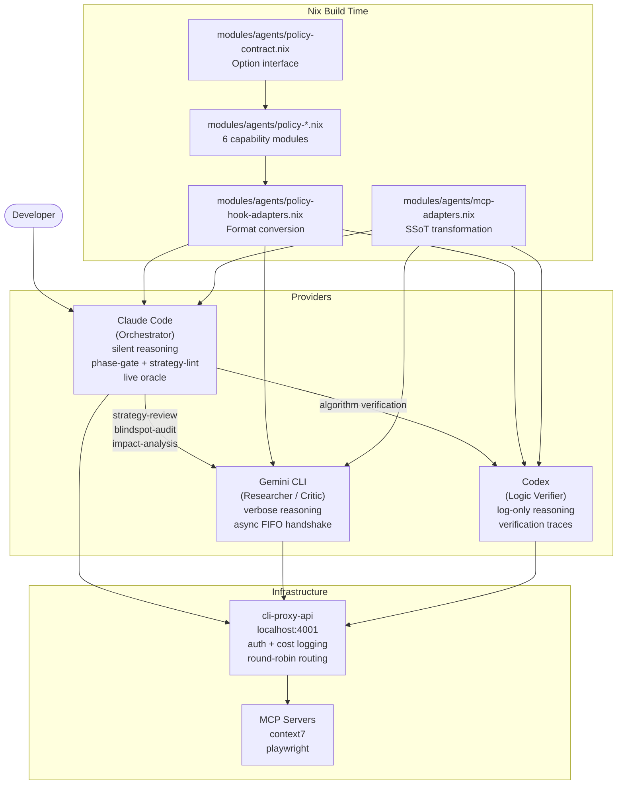

# Multi-Provider Agent Orchestration

This repository coordinates three AI providers under a unified policy contract. Claude Code acts as the primary orchestrator, Gemini CLI handles research and critique, and Codex provides logic verification. A local proxy (cli-proxy-api) unifies authentication and cost logging across all three.

## Architecture



## MCP Server Single Source of Truth

MCP servers are declared once in `modules/agents/agents-mcp.nix` and adapted to each provider's required format by `modules/agents/mcp-adapters.nix`. No provider-specific MCP configuration is written by hand.

```
modules/agents/agents-mcp.nix   (canonical server definitions)
        |
        v
modules/agents/mcp-adapters.nix (SSoT transformer)
        |
        +---> claude format     (passed through as-is → ~/.claude.json)
        +---> gemini format     (command + args only → ~/.gemini/settings.json)
        +---> codex format      (adds enabled flag, renames headers → ~/.codex/config.toml)
```

Current servers: `context7` and `playwright`.

## Configuration Sync

Each provider has a dedicated Nix module in `modules/agents/`. All modules follow the same pattern: generate a settings file at `nix build` time, then use an activation script to merge it into the live mutable config.

| Provider | Nix Module | Sync Strategy | Target File |
|---|---|---|---|
| Claude | `modules/agents/claude.nix` | `mkJsonSync` (deep-merge) | `~/.claude/settings.json`, `~/.claude.json` |
| Gemini | `modules/agents/gemini.nix` | `mkJsonSync` (deep-merge) | `~/.gemini/settings.json` |
| Codex | `modules/agents/codex.nix` | `mkTomlSync` (generated TOML + selected runtime state) | `~/.codex/config.toml` |

`modules/agents/mutable-settings-sync.nix` provides these helpers. Deep-merge preserves runtime data (OAuth tokens, project history, usage stats) that the provider CLIs write back to their config files. TOML sync is used for Codex so Nix-owned settings stay generated while Codex-owned hook trust and project trust survive activation.

Static assets (commands, agents, skills, hooks) are managed separately as read-only symlinks via `home.file` in `claude.nix`.

## Shared Workflow Bindings

Command-style workflows are declared once in `modules/agents/workflow-bindings.nix`.
The registry promotes curated prompts from `dotfiles/claude/commands/` into
provider-neutral workflow metadata and provider adapters:

```
dotfiles/claude/commands/*.md      (source prompts)
        |
        v
modules/agents/workflow-bindings.nix
        |
        +---> Claude: native slash commands + ~/.claude/WORKFLOWS.md
        +---> Codex: workflow-* skills in programs.codex.skills
        +---> Gemini/agy: AGENT_WORKFLOWS context guide
```

Private helper files and session-specific commands are intentionally not
promoted. The workflow registry uses an explicit allowlist so new commands do
not silently become cross-provider skills.

## Agent Policy Contract

The policy-*.nix modules in `modules/agents/` encode the behavioral rules from `CLAUDE.md` as Nix module options that are validated at build time. Each provider declares its capabilities against a shared interface; Nix assertions reject invalid combinations before any code is deployed.

Full documentation: [architecture/agent-policy-contract.md](../architecture/agent-policy-contract.md)

## Provider Comparison

| Provider | Role | Reasoning Mode | Async | Oracle | Phase Gate | Strategy Lint |
|---|---|---|---|---|---|---|
| Claude | Orchestrator | silent | — | `nix flake check` | L-complexity gate on Write/Edit | Gemini peer review required |
| Gemini | Researcher / Critic | verbose | FIFO (3 tasks) | — | — | — |
| Codex | Logic Verifier | log-only | — | — | — | — |

**Reasoning modes:**

- `silent` — chain-of-thought is written to `/tmp/agent-traces/` but not shown in conversation; only decisions and actions surface
- `verbose` — full reasoning is visible in the terminal; appropriate for research tasks where the thought process is the output
- `log-only` — tool output is appended to trace files at `/tmp/agent-traces/codex/`; nothing is shown in conversation

## Inter-Provider Communication

Providers do not call each other directly. Communication happens through three mechanisms:

**FIFO pipes (Gemini async tasks)**

When Claude needs a strategy review, it writes a task description to a named pipe in `/tmp/agent-handshake/gemini/`. Gemini reads from the pipe, runs the analysis, and writes results to `/tmp/agent-handshake/gemini/results/`. Claude polls for the result file. The three supported task names are `strategy-review`, `blindspot-audit`, and `impact-analysis`.

**Shared state files (phase coordination)**

Phase state is stored as flat files in `/tmp/agent-policy/phases/<provider>/<session-id>`. The phase-gate hook reads this file before allowing Write or Edit calls. An `.approved` suffix signals that the strategy has been reviewed.

**agent-notify.sh notifications**

Each provider fires `~/.claude/hooks/agent-notify.sh <provider>` on session end. On macOS this triggers a system notification. The script is also used for human escalation when the escalation-gate hook detects repeated failures.

## Module Structure

```
modules/agents/
├── agents-module.hm.nix        # imports all provider modules + policy assembler
├── agents-mcp.nix              # MCP server SSoT (programs.mcp.servers)
├── mcp-adapters.nix            # SSoT: programs.mcp.servers → per-provider format
├── claude.nix                  # Claude: dotfiles + activation + policy contract
├── gemini.nix                  # Gemini: settings + policy contract
├── codex.nix                   # Codex: config.toml + policy contract
├── codex-bindings.nix          # Codex roles, skills, agents, permissions
├── workflow-bindings.nix       # Shared command workflows -> provider adapters
├── agents-proxy.nix            # cli-proxy-api binary + launchd service (macOS)
├── mutable-settings-sync.nix     # mutable config sync helpers
├── policy-contract.nix         # Interface: agentPolicy option types
├── policy-assertions.nix       # build-time contract assertions
├── policy-assembler.nix        # IoC assembler (entry point)
├── policy-hook-adapters.nix    # SSoT format adapter (claude/gemini/codex)
├── policy-provider-hooks.nix   # base + policy hook merge helper
├── policy-phase-gate.nix       # capability mixin: phase gate
├── policy-path-guard.nix       # capability mixin: path guard
├── policy-strategy-lint.nix    # capability mixin: strategy lint
├── policy-reasoning-trace.nix  # capability mixin: reasoning trace
├── policy-async-handshake.nix  # capability mixin: async FIFO handshake
└── policy-live-oracle.nix      # capability mixin: live oracle
```
