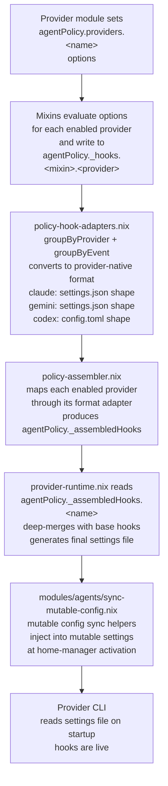

# Agent Policy Contract System

The Agent Policy Contract system translates behavioral rules from `CLAUDE.md` into Nix module options that are validated at build time. Violations cause `nix build` to fail with a descriptive message before any hook script reaches a provider's settings file.

## Motivation

Text-based guardrails in `CLAUDE.md` work until they do not. A hook script might be missing, a required section might be skipped under time pressure, or a new provider might be added without implementing the full policy suite. These failures are silent: the developer only discovers the missing guardrail when the situation it was designed to handle occurs.

The contract system makes the same rules structural:

- **A missing peerReviewProvider is a build error**, not a runtime surprise.
- **An empty gatedTools list with enforcement enabled is a build error**, not a hook that silently passes everything.
- **A new enabled provider without runtime hook metadata is a build error**, not a config file that fails to load.

The Nix module system already provides the infrastructure needed for this: option type declarations act as interfaces, provider modules act as implementations, and `config.assertions` act as contract validation.

## Pattern Mapping

| OOP / DDD Concept | Nix Module System Equivalent | Location |
|---|---|---|
| Contract / Interface | `mkOption` type declarations | `modules/agents/policy-contract.nix` |
| Implementation | Provider module sets `agentPolicy.providers.<name>` values | `modules/agents/<provider>.nix` |
| Assertion / Precondition | `config.assertions` — fails `nix build` on violation | `modules/agents/policy-assertions.nix` |
| Mixin / Trait | `policy-<name>.nix` file that reads options and writes `_hooks` | `modules/agents/policy-*.nix` |
| IoC Container | Nix module system auto-wires option producers to consumers | `modules/agents/policy-assembler.nix` |
| Adapter | Format conversion from canonical hooks to provider-native | `modules/agents/policy-hook-adapters.nix` |

## File Layout

All policy files live flat under `modules/agents/` with a `policy-` prefix. There is no `policy/` subdirectory or `mixins/` subfolder.

| File | Role |
|---|---|
| `policy-contract.nix` | Interface: `agentPolicy.providers.<name>` option types |
| `policy-assertions.nix` | build-time contract assertions |
| `policy-assembler.nix` | IoC assembler — imports all `policy-*` files, produces `_assembledHooks` |
| `policy-hook-adapters.nix` | SSoT format adapter (claude / gemini / codex) |
| `policy-provider-hooks.nix` | base + policy hook merge helper |
| `policy-phase-gate.nix` | mixin: phase-gate |
| `policy-path-guard.nix` | mixin: path-guard |
| `policy-strategy-lint.nix` | mixin: strategy-lint |
| `policy-reasoning-trace.nix` | mixin: reasoning-trace |
| `policy-async-handshake.nix` | mixin: async-handshake |
| `policy-live-oracle.nix` | mixin: live-oracle |

`sync-mutable-config.nix` (providing mutable config sync helpers) also lives in `modules/agents/` and is used by the hook generation flow to inject assembled hooks into mutable settings files at activation time.

## Contract Interface

`modules/agents/policy-contract.nix` defines a `providerModule` submodule with six option groups. Every provider that sets `agentPolicy.providers.<name>` must satisfy this type.

### (A) reasoning

Controls whether the agent's chain-of-thought is displayed, logged, or suppressed.

| Field | Type | Values | Default |
|---|---|---|---|
| `mode` | enum | `silent`, `verbose`, `log-only` | `"verbose"` |
| `traceDir` | string | filesystem path | `"/tmp/agent-traces"` |

`silent`: reasoning is written to `traceDir/<provider>/<session>.log`; only lines matching `^\[` or starting with `DECISION:`, `ACTION:`, `RESULT:`, `OUTPUT:` are emitted to the terminal.

`verbose`: full output passes through unchanged. No hook file is generated.

`log-only`: all tool output is appended to the trace log. Nothing is shown in the terminal.

### (B) async

Configures background task execution via FIFO pipes.

| Field | Type | Default |
|---|---|---|
| `enabled` | bool | `false` |
| `backgroundTasks` | list of string | `[]` |
| `handshakeProtocol` | enum: `poll`, `fifo`, `callback` | `"fifo"` |
| `fifoDir` | string | `"/tmp/agent-handshake"` |

When `enabled = true`, a named pipe is created in `fifoDir/<provider>/` for each entry in `backgroundTasks`. A `PostToolUse` hook captures completion records to `fifoDir/<provider>/results/`.

### (D) oracle

Runs shell commands after file mutations to verify the environment remains healthy.

| Field | Type | Default |
|---|---|---|
| `enabled` | bool | `false` |
| `healthChecks` | list of `{ command, pattern, timeout }` | `[]` |
| `streamAnalysis` | bool | `false` |

Each health check runs only when the mutated file path matches `pattern` (a regex). If `streamAnalysis = true`, failed checks are re-executed with their output captured and printed inline.

### (E) phases

Enforces the RESEARCH → STRATEGY → EXECUTION state machine by blocking certain tools until a complexity classification and approval exist.

| Field | Type | Default |
|---|---|---|
| `enforced` | bool | `false` |
| `stateDir` | string | `"/tmp/agent-phases"` |
| `gatedTools` | list of string | `["Write" "Edit"]` |

State is stored in flat files at `agentPolicy.global.stateRoot/phases/<provider>/<session-id>`. The first character of this file holds the complexity level (`S`, `M`, or `L`). An `<session-id>.approved` file signals strategy approval.

### (F) strategyLint

Validates that strategy documents contain required sections and that a peer review exists before allowing execution.

| Field | Type | Default |
|---|---|---|
| `enabled` | bool | `false` |
| `requiredSections` | list of string | `[]` |
| `peerReviewProvider` | null or string | `null` |
| `strategyPath` | string | `"/tmp/agent-strategy"` |

When `peerReviewProvider` is set, the mixin also checks for `<strategyPath>/<session-id>-review.md`. If that file is absent, mutation tools are blocked.

### Provider Runtime Metadata

`agentPolicy.providers.<name>` intentionally contains policy capabilities only. Provider-native hook rendering metadata lives under the internal `agentPolicy._providerRuntime.<name>.hooks` namespace and is consumed by `modules/agents/policy-assembler.nix`.

| Field | Type | Required |
|---|---|---|
| `format` | one of the hook adapter names in `policy-hook-adapters.nix` | yes |
| `timeout` | int (seconds) | `5` |

## Build-Time Assertions

`modules/agents/policy-assertions.nix` adds seven entries to `config.assertions`. All checks run across every enabled provider. A failing assertion terminates `nix build` with the message shown.

| # | Condition | Error Message |
|---|---|---|
| 1 | `strategyLint.enabled → peerReviewProvider != null` | `strategyLint.enabled=true requires peerReviewProvider to be set` |
| 2 | `peerReviewProvider → provider exists in agentPolicy.providers` | `strategyLint.peerReviewProvider references a non-existent provider` |
| 3 | `phases.enforced → gatedTools != []` | `phases.enforced=true but gatedTools is empty` |
| 4 | `oracle.enabled → healthChecks != []` | `oracle.enabled=true but no healthChecks defined` |
| 5 | `async.enabled → backgroundTasks != []` | `async.enabled=true but no backgroundTasks defined` |
| 6 | `strategyLint.enabled → requiredSections != []` | `strategyLint.enabled=true but requiredSections is empty` |
| 7 | `provider.enable → agentPolicy._providerRuntime.<name> exists` | `enabled provider is missing agentPolicy._providerRuntime.<name>` |

## Mixins

Six mixin modules live flat in `modules/agents/` with the `policy-` prefix. Each reads from `config.agentPolicy.providers` and writes to `config.agentPolicy._hooks.<mixin-name>`, the internal hook registry. The mixin is only active when the relevant option is enabled.

| Mixin | File | Trigger Option | Generated Hook Event | What It Produces |
|---|---|---|---|---|
| phase-gate | `policy-phase-gate.nix` | `phases.enforced = true` | `PreToolUse` | Blocks `gatedTools` for L-complexity sessions without `.approved` marker |
| path-guard | `policy-path-guard.nix` | provider `enable = true` | `PreToolUse` | Blocks Read/Write/Edit on patterns from `global.sensitivePatterns` |
| strategy-lint | `policy-strategy-lint.nix` | `strategyLint.enabled = true` | `PreToolUse` | Validates strategy doc sections; gates on peer review file existence |
| reasoning-trace | `policy-reasoning-trace.nix` | `reasoning.mode != "verbose"` | `PostToolUse` | Logs or filters tool output based on `silent` vs `log-only` mode |
| async-handshake | `policy-async-handshake.nix` | `async.enabled = true` | `PostToolUse` | Captures Agent tool completion records; FIFO setup in activation |
| live-oracle | `policy-live-oracle.nix` | `oracle.enabled = true` | `PostToolUse` | Runs health check commands after Write/Edit; reports failures |

## Hook Generation Flow



## Provider Implementations

### Claude (Orchestrator)

Full policy suite. Every mixin except async-handshake is active.

```nix
agentPolicy.providers.claude = {
  enable = true;
  reasoning.mode = "silent";
  reasoning.traceDir = "/tmp/agent-traces";
  oracle.enabled = true;
  oracle.healthChecks = [{
    command = "nix flake check --no-build 2>&1 | head -20";
    pattern = ".*\\.nix$";
    timeout = 60;
  }];
  oracle.streamAnalysis = true;
  phases.enforced = true;
  phases.stateDir = "/tmp/claude-complexity";
  phases.gatedTools = ["Write" "Edit" "NotebookEdit"];
  strategyLint.enabled = true;
  strategyLint.requiredSections = ["pre-mortem" "tradeoffs" "peer-review"];
  strategyLint.peerReviewProvider = "gemini";
  strategyLint.strategyPath = "/tmp/agent-strategy";
};
```

`agentPolicy._providerRuntime.claude.hooks` supplies the internal hook render format and timeout used by the provider runtime layer.

Active mixins: phase-gate, path-guard, strategy-lint, reasoning-trace, live-oracle.

Hook output format: `settings.json` with event keys mapping to arrays of `{ matcher, hooks: [{ type, command, timeout }] }` objects.

### Gemini (Researcher / Critic)

Async-capable configuration. Three background tasks, verbose reasoning.

```nix
agentPolicy.providers.gemini = {
  enable = true;
  reasoning.mode = "verbose";
  async.enabled = true;
  async.handshakeProtocol = "fifo";
  async.backgroundTasks = ["strategy-review" "blindspot-audit" "impact-analysis"];
  async.fifoDir = "/tmp/agent-handshake";
};
```

`agentPolicy._providerRuntime.gemini.hooks` supplies the internal hook render format and timeout used by the provider runtime layer.

Active mixins: path-guard, async-handshake. (reasoning-trace is a no-op in verbose mode; phase-gate, strategy-lint, live-oracle are not enabled.)

### Codex (Logic Verifier)

Minimal configuration. Log-only reasoning, no other capabilities.

```nix
agentPolicy.providers.codex = {
  enable = true;
  reasoning.mode = "log-only";
  reasoning.traceDir = "/tmp/agent-traces";
};
```

`agentPolicy._providerRuntime.codex.hooks` supplies the internal hook render format and timeout used by the provider runtime layer.

Active mixins: path-guard, reasoning-trace.

Hook output format: `config.toml` with event keys mapping to arrays of `{ hooks: [{ type, command, timeout }] }` objects.

## Adding a New Provider

1. Create `modules/agents/<name>.nix`.
2. Set `agentPolicy.providers.<name> = { enable = true; ... }` with whatever policy capabilities the provider needs.
3. Set `agentPolicy._providerRuntime.<name>.hooks = { format = "..."; timeout = 5; }` so the internal assembler can render hooks in that provider's native format.
4. Ensure `policy-assembler.nix` is imported (it imports all `policy-*` files and the contract). This is typically handled by including the new module in `modules/agents/agents-module.hm.nix`.
5. If the provider uses a format not already in `policy-hook-adapters.nix` (currently `claude`, `gemini`, `codex`), add a new format function to `policy-hook-adapters.nix` that maps the internal `{ event, matcher, script }` structure to the provider's settings schema.
6. Run `nix build`. Assertions will catch any missing required options.

## Adding a New Mixin

1. Create `modules/agents/policy-<name>.nix`.
2. In the module body, read from `config.agentPolicy.providers` — filter to providers where the relevant option is enabled.
3. For each matching provider, generate a shell script using `pkgs.writeShellScript`.
4. Write hook entries to `config.agentPolicy._hooks.<name>` as an attrset of `{ event, matcher, script }` per provider name.
5. Add the new mixin to the imports list in `modules/agents/policy-assembler.nix`. The hook will automatically appear in each matching provider's assembled settings after the next `just apply`.

## Adding a New Assertion

Add a new attrset to the `config.assertions` list in `modules/agents/policy-assertions.nix`:

```nix
{
  assertion = forAllEnabled (_: p:
    # your predicate — return true when the config is valid
    !p.someOption.enabled || p.someOption.requiredField != null);
  message = "[AgentPolicy] descriptive error message for the developer";
}
```

The `forAllEnabled` helper iterates over all providers where `enable = true` and short-circuits on the first violation. The message is printed by `nix build` when the assertion fails.

## Global Configuration

`agentPolicy.global` holds cross-cutting settings shared by all providers:

| Option | Default | Purpose |
|---|---|---|
| `stateRoot` | `"/tmp/agent-policy"` | Root directory for all phase state files |
| `sensitivePatterns` | `.env*`, `*.pem`, `*.key`, `secrets/*`, etc. | File patterns blocked by path-guard on all providers |
| `maxRetries` | `3` | Max consecutive failures before escalation-gate triggers |
