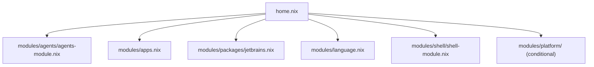

# Module System

## Module Categories

`home.nix` imports four top-level module groups, each with a distinct responsibility:

| Module | Path | Responsibility |
|---|---|---|
| Agents | `modules/agents/` | AI provider policy contracts, MCP servers, cli-proxy-api |
| Shell | `modules/shell/` | fish, git, neovim, fzf, direnv, yazi, zellij, utilities |
| Languages | `modules/language.nix` | Toolchains, LSP servers, formatters, linters |
| Apps | `modules/apps.nix` | GUI applications, platform-conditional |
| JetBrains | `modules/packages/jetbrains.nix` | JetBrains IDEs |
| Platform | `modules/platform/` | NixOS (Hyprland) and WSL specifics |

Platform modules are imported conditionally:

```nix
# home.nix (excerpt)
++ lib.optionals isNixOs  [ ./modules/platform/hyprland.nix ]
++ lib.optionals (isLinux && !isNixOs) [ ./modules/platform/wsl.nix ]
```

## Shell Modules

`modules/shell/` is further decomposed:

| File | Contents |
|---|---|
| `default.nix` | Imports all shell submodules |
| `fish.nix` | fish shell, abbreviations, environment |
| `git.nix` | git config, delta pager |
| `editor.nix` | Neovim (LazyVim), treesitter, LSP |
| `editor.overlay.nix` | Neovim overlay (auto-collected) |
| `fzf.nix` | fzf with fish integration |
| `direnv.nix` | direnv + nix-direnv |
| `yazi.nix` | yazi file manager |
| `utils.nix` | bat, ripgrep, jq, lazygit, gh, sops, age, zellij |
| `infra.nix` | awscli, nuclei, ngrok (macOS only) |
| `network.nix` | Network utilities |
| `monitor.nix` | System monitoring tools |

## Overlay Convention

Any file named `*.overlay.nix` inside `modules/` is auto-discovered by `lib/discover-overlays.nix`. The function walks the directory tree and applies every matching file as a nixpkgs overlay.

```nix
# lib/discover-overlays.nix (conceptual)
# Returns: [ overlay1 overlay2 ... ]
collectOverlays = dir: lib.flatten (
  map (f: import f) (findFiles "*.overlay.nix" dir)
);
```

The only current example is `modules/shell/editor.overlay.nix`, which patches the Neovim package. To add a new overlay, create `modules/<area>/my-package.overlay.nix` — no other file needs to change.

## lib/ Utilities

| File | Purpose |
|---|---|
| `lib/mk-home-config.nix` | `mkSystem` and `mkHomeConfig` factory functions |
| `lib/sync-mutable-config.nix` | `mkJsonSync` — write JSON configs that home-manager cannot symlink (e.g. Claude settings, which the agent writes at runtime) |
| `lib/mcp-adapters.nix` | Transforms `programs.mcp.servers` (SSoT) into provider-specific MCP JSON formats |
| `lib/discover-overlays.nix` | Auto-collects `*.overlay.nix` files |
| `lib/discover-modules.nix` | Auto-discovers user profiles from `user/` |
| `lib/platform.nix` | Computes `isDarwin`, `isLinux`, `isWsl`, `isNixOs` |
| `lib/keymaps/` | Generates Karabiner JSON and AeroSpace TOML from a single `keybinds.nix` source |
| `lib/mk-images.nix` | Builds ISO, VirtualBox, VMware, and qcow images via `nixos-generators` |

## How home.nix Imports Everything



`home.nix` also sets `home.file` entries for dotfiles (nix config, zellij, hyprland, Karabiner, AeroSpace) and passes `keymaps` and `zellijConfig` computed from `lib/`.

## Adding a New Module

1. Create the file, e.g. `modules/shell/my-tool.nix`:

```nix
{ pkgs, lib, isDarwin, ... }: {
  home.packages = with pkgs; [
    my-tool
  ] ++ lib.optionals isDarwin [ my-tool-macos-extra ];
}
```

2. Import it from the parent `default.nix`:

```nix
# modules/shell/shell-module.nix
imports = [
  ./fish.nix
  ./git.nix
  # ...
  ./my-tool.nix   # add here
];
```

3. Run `just apply` to activate.

No changes to `flake.nix` or `home.nix` are required for submodules.

## Adding a New Package

For a package that belongs in an existing category, find the right module and add it to `home.packages`:

| Category | File to edit |
|---|---|
| Language toolchain or LSP | `modules/language.nix` |
| GUI app | `modules/apps.nix` |
| CLI utility | `modules/shell/utils.nix` |
| Infrastructure/DevOps | `modules/shell/infra.nix` |
| JetBrains IDE | `modules/packages/jetbrains.nix` |

Example — adding a CLI tool:

```nix
# modules/shell/utils.nix
home.packages = with pkgs; [
  bat
  jq
  my-new-tool   # add here
  # ...
];
```

Then run `just apply`. If the package is not in `nixpkgs`, add it via an overlay file first.
