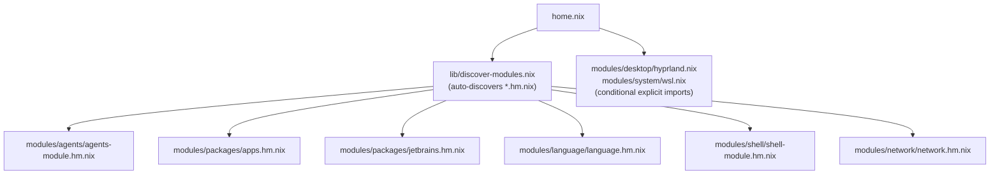

# Module System

## File-Suffix Convention

`modules/` is organized by domain. Each domain folder can contain home-manager modules, NixOS modules, and overlays, distinguished by file-suffix:

| Suffix | Role | Discovery |
|---|---|---|
| `*.hm.nix` | home-manager entrypoint | auto-discovered into `home.nix` via `discover-modules.nix` |
| `*.nixos.nix` | NixOS entrypoint | auto-discovered into `configuration.nix` via `discover-modules.nix` |
| `*.overlay.nix` | nixpkgs overlay | auto-collected by `collect-overlays.nix` |
| plain `*.nix` | sub-module or conditional import | pulled in by an entrypoint's `imports`, or imported explicitly |

`hyprland.nix` (desktop) and `wsl.nix` (system) are plain `.nix` files — they are NOT auto-discovered. `home.nix` imports them conditionally:

```nix
# home.nix (excerpt)
++ lib.optionals isNixOs        [ ./modules/desktop/hyprland.nix ]
++ lib.optionals (isLinux && !isNixOs) [ ./modules/system/wsl.nix ]
```

## Module Categories

`home.nix` obtains its auto-discovered import list from `lib/discover-modules.nix`, plus a handful of explicit conditional imports:

| Domain | Path | Responsibility |
|---|---|---|
| Agents | `modules/agents/` | AI provider policy contracts, MCP servers, cli-proxy-api |
| Shell | `modules/shell/` | fish, git, neovim, fzf, direnv, yazi, zellij, utilities |
| Languages | `modules/language/language.hm.nix` | Toolchains, LSP servers, formatters, linters |
| Apps | `modules/packages/apps.hm.nix` | GUI applications, platform-conditional |
| JetBrains | `modules/packages/jetbrains.hm.nix` | JetBrains IDEs |
| Desktop | `modules/desktop/` | Hyprland (NixOS, conditional plain .nix) |
| Network | `modules/network/` | Network utilities hm + NixOS config |
| System | `modules/system/` | WSL (conditional plain .nix) + NixOS system modules |

## Shell Modules

`modules/shell/` is further decomposed:

| File | Contents |
|---|---|
| `shell-module.hm.nix` | Shell domain entrypoint discovered by `home.nix` |
| `fish.nix` | fish shell, abbreviations, environment |
| `git.nix` | git config, delta pager |
| `editor.nix` | Neovim (LazyVim), treesitter, LSP |
| `editor.overlay.nix` | Neovim overlay (auto-collected) |
| `fzf.nix` | fzf with fish integration |
| `direnv.nix` | direnv + nix-direnv |
| `yazi.nix` | yazi file manager |
| `utils.nix` | bat, ripgrep, jq, lazygit, gh, sops, age, zellij |
| `infra.nix` | awscli, nuclei (macOS only) |
| `monitor.nix` | System monitoring tools |

## Overlay Convention

Any file named `*.overlay.nix` inside `modules/` is auto-discovered by `lib/collect-overlays.nix`. The function walks the directory tree recursively and collects every matching file as a nixpkgs overlay.

```nix
# flake.nix (excerpt)
overlays = (import ./lib/collect-overlays.nix { inherit lib; } ./modules)
           ++ [ llm-agents.overlays.default ];
```

The only current example is `modules/shell/editor.overlay.nix`, which patches the Neovim package. To add a new overlay, create `modules/<domain>/my-package.overlay.nix` — no other file needs to change.

## lib/ Utilities

| File | Purpose |
|---|---|
| `lib/mk-home-config.nix` | `mkSystem` and `mkHomeConfig` factory functions; derives `isDarwin`/`isLinux` from `pkgs.stdenv` and delivers all four platform booleans via `extraSpecialArgs` |
| `lib/collect-overlays.nix` | `{lib}: dir → [overlays]`; recursively collects every `*.overlay.nix` under `dir` |
| `lib/discover-modules.nix` | `{lib}: dir → { homeManager = [...]; nixos = [...] }`; classifies entrypoints by file-suffix convention (`*.hm.nix` vs `*.nixos.nix`) |
| `lib/mk-images.nix` | Builds ISO, VirtualBox, VMware, and qcow images via nixpkgs `system.build.images` |
| `lib/mk-zellij-config.nix` | Generates Zellij configuration |

`sync-mutable-config.nix` (providing `mkJsonSync` / `mkFileCopy`) was moved from `lib/` to `modules/agents/sync-mutable-config.nix` because it is an agents-only concern.

Two subsystems that live in `modules/` (not `lib/`):

| Module | Purpose |
|---|---|
| `modules/agents/mcp-adapters.nix` | Transforms `programs.mcp.servers` (SSoT) into provider-specific MCP JSON formats |
| `modules/keymap/` | Generates Karabiner JSON and AeroSpace TOML from a single `binds.nix` source |

## How home.nix Imports Everything



`home.nix` also sets `home.file` entries for dotfiles (nix config, zellij, hyprland, Karabiner, AeroSpace) and passes `keymaps` and `zellijConfig` computed from `lib/`.

## Adding a New Module

1. Create the file, e.g. `modules/shell/my-tool.nix`:

```nix
{ pkgs, lib, isDarwin, ... }: {
  home.packages = with pkgs; [
    my-tool
  ] ++ lib.optionals isDarwin [ my-tool-macos-extra ];
}
```

2. Import it from the domain entrypoint:

```nix
# modules/shell/shell-module.hm.nix
imports = [
  ./fish.nix
  ./git.nix
  # ...
  ./my-tool.nix   # add here
];
```

3. Run `just apply` to activate.

No changes to `flake.nix` or `home.nix` are required for submodules.

If you instead want a new auto-discovered entrypoint, name it `my-domain/my-module.hm.nix` — `discover-modules.nix` picks it up automatically on the next build.

## Adding a New Package

For a package that belongs in an existing category, find the right module and add it to `home.packages`:

| Category | File to edit |
|---|---|
| Language toolchain or LSP | `modules/language/language.hm.nix` |
| GUI app | `modules/packages/apps.hm.nix` |
| CLI utility | `modules/shell/utils.nix` |
| Infrastructure/DevOps | `modules/shell/infra.nix` |
| JetBrains IDE | `modules/packages/jetbrains.hm.nix` |

Example — adding a CLI tool:

```nix
# modules/shell/utils.nix
home.packages = with pkgs; [
  bat
  jq
  my-new-tool   # add here
  # ...
];
```

Then run `just apply`. If the package is not in `nixpkgs`, add it via an overlay file first.
