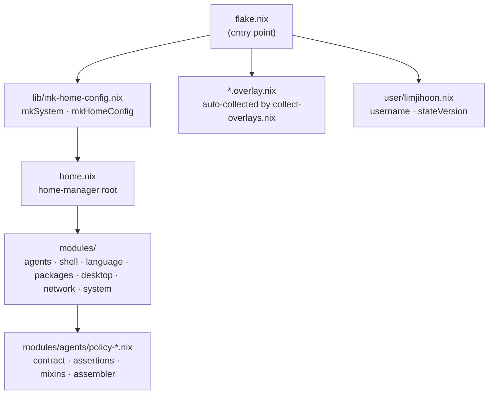
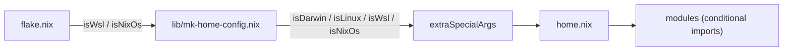

# Architecture Overview

## Repository Layout

```
flake.nix                       # Entry point — outputs, inputs, overlays
home.nix                        # home-manager root (auto-discovers *.hm.nix)
CLAUDE.md                       # Governance doc for Claude Code sessions

modules/
  agents/
    agents-module.hm.nix        # Orchestration root (imports policy-assembler.nix)
    claude.nix                  # Claude contract impl (orchestrator)
    gemini.nix                  # Gemini contract impl (researcher)
    codex.nix                   # Codex contract impl (verifier)
    agents-mcp.nix              # MCP server definitions (SSoT)
    mcp-adapters.nix            # MCP server SSoT adapter
    agents-proxy.nix            # cli-proxy-api + launchd
    sync-mutable-config.nix     # mutable config sync helpers (agents-only concern)
    policy-contract.nix         # Interface: agentPolicy.providers.<name> option types
    policy-assertions.nix       # build-time contract assertions
    policy-assembler.nix        # IoC assembler (imports all policy-* files)
    policy-hook-adapters.nix    # SSoT format adapter (claude/gemini/codex)
    policy-provider-hooks.nix   # base + policy hook merge helper
    policy-phase-gate.nix       # mixin: phase-gate
    policy-path-guard.nix       # mixin: path-guard
    policy-strategy-lint.nix    # mixin: strategy-lint
    policy-reasoning-trace.nix  # mixin: reasoning-trace
    policy-async-handshake.nix  # mixin: async-handshake
    policy-live-oracle.nix      # mixin: live-oracle
  shell/                        # fish, git, neovim, fzf, direnv, yazi, zellij
  language/language.hm.nix      # Toolchains — Go, Java, Rust, Python, Node, Lua, Nix
  packages/
    apps.hm.nix                 # GUI apps — claude-code, antigravity-cli, codex, platform-specific
    apps.overlay.nix            # Package overlay for apps
    jetbrains.hm.nix            # JetBrains IDEs
  keymap/                       # Karabiner + AeroSpace config generation
  desktop/
    hyprland.nix                # Hyprland (NixOS, imported conditionally)
    desktop.nixos.nix           # NixOS desktop configuration
    remote-desktop.nixos.nix    # NixOS remote desktop
  network/
    network.hm.nix              # Network utilities (home-manager)
    network.nixos.nix           # NixOS network configuration
  system/
    wsl.nix                     # WSL specifics (imported conditionally)
    boot.nixos.nix              # NixOS boot configuration
    hardware.nixos.nix          # NixOS hardware configuration
    # ... other *.nixos.nix system modules

lib/
  collect-overlays.nix          # {lib}: dir → [overlays]; recursively collects *.overlay.nix
  discover-modules.nix          # {lib}: dir → { homeManager = [*.hm.nix]; nixos = [*.nixos.nix] }
  mk-home-config.nix            # mkSystem, mkHomeConfig
  mk-images.nix                 # Builds ISO, VirtualBox, VMware, qcow images
  mk-zellij-config.nix          # Zellij config generation

dotfiles/
  claude/
    hooks/                      # Shell-based hook scripts (statusline, guards)
    commands/                   # Slash commands (/commit, /scaffold, /blog-korean, ...)
    agents/                     # Sub-agent definitions (architect, researcher, ...)
    skills/                     # Reusable skills (code-implementation, test-development, ...)
    settings.json               # Base Claude Code settings (permissions, hooks)
  shared/AGENTS.md              # Cross-provider agent instruction set

user/limjihoon.nix              # User profile (username, stateVersion)
justfile                        # Task runner — bootstrap, apply, gc, lint, test
```

## Flake Structure



The flake produces `homeConfigurations` outputs (one per platform/arch combination) and `nixosConfigurations` for NixOS hosts. Image outputs (`packages.*`) are built via `lib/mk-images.nix`.

## How Overlays Work

Any file named `*.overlay.nix` inside `modules/` is auto-collected by `lib/collect-overlays.nix` and applied to nixpkgs. The `llm-agents.nix` flake overlay is appended on top, which provides `claude-code`, `antigravity-cli`, `codex`, and `cli-proxy-api`.

```nix
# flake.nix (excerpt)
overlays = (import ./lib/collect-overlays.nix { inherit lib; } ./modules)
           ++ [ llm-agents.overlays.default ];
```

The convention allows new packages to be injected into nixpkgs by dropping a `*.overlay.nix` file into the relevant module directory without modifying `flake.nix`.

## How User Profiles Work

`flake.nix` directly inlines user profile loading by reading each `.nix` file in the `user/` directory and passing the result as `userProfile` to `mkHomeConfig`, which uses it to set `home.username` and `home.stateVersion`.

```nix
# user/limjihoon.nix (conceptual shape)
{
  username = "limjihoon";
  stateVersion = "24.05";
}
```

Adding a new user means adding `user/<username>.nix` and passing it to `mkHomeConfig`.

## How Platform Detection Works

`lib/mk-home-config.nix` derives `isDarwin` and `isLinux` from `pkgs.stdenv`. The booleans `isWsl` and `isNixOs` are passed in directly by `flake.nix` per-host. All four are threaded through `extraSpecialArgs` to every module:

| Flag | Source |
|---|---|
| `isDarwin` | `pkgs.stdenv.isDarwin` (derived in `mk-home-config.nix`) |
| `isLinux` | `pkgs.stdenv.isLinux` (derived in `mk-home-config.nix`) |
| `isWsl` | Passed as `isWsl = true` to `mkHomeConfig` by `flake.nix` |
| `isNixOs` | Passed as `isNixOs = true` to `mkHomeConfig` by `flake.nix` |

There is no `platform` feature-struct. Modules use the four booleans directly with `lib.optionals isDarwin [...]` and similar expressions.


