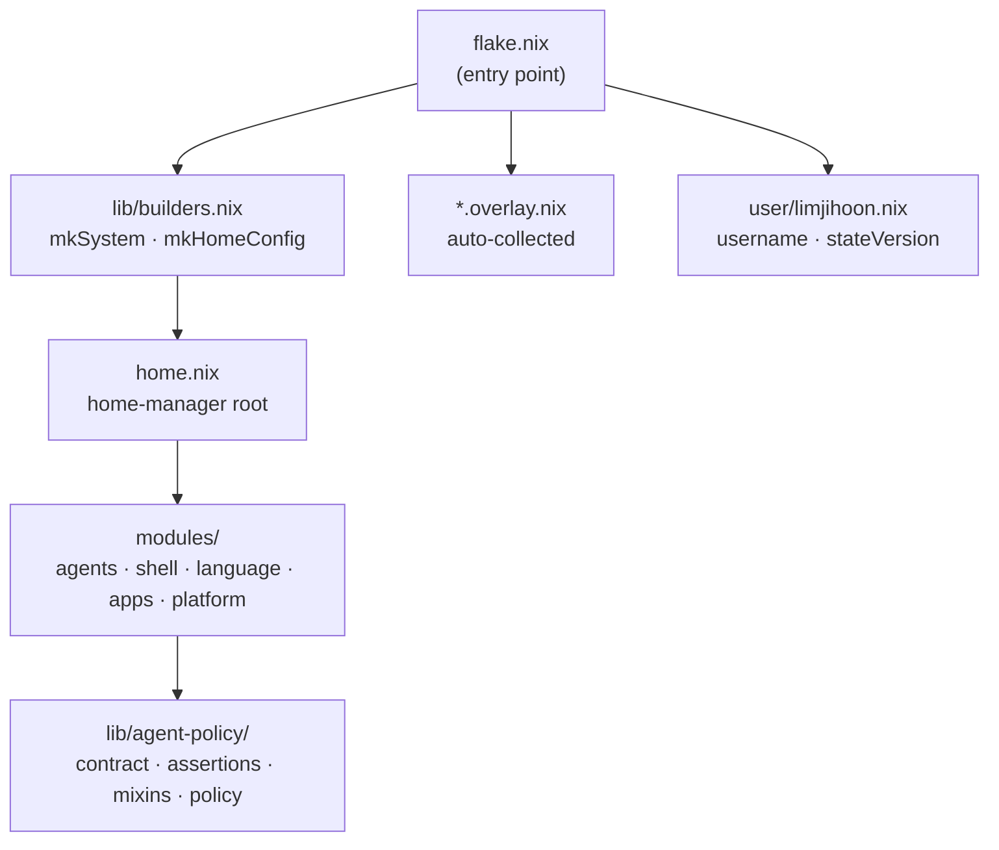
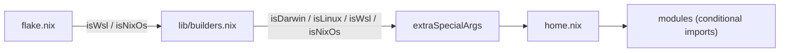

# Architecture Overview

## Repository Layout

```
flake.nix                       # Entry point — outputs, inputs, overlays
home.nix                        # home-manager root (imports modules/)
CLAUDE.md                       # Governance doc for Claude Code sessions

modules/
  agents/
    default.nix                 # Orchestration root (imports policy.nix)
    claude.nix                  # Claude contract impl (orchestrator)
    gemini.nix                  # Gemini contract impl (researcher)
    codex.nix                   # Codex contract impl (verifier)
    mcp.nix                     # MCP server definitions (SSoT)
    proxy.nix                   # cli-proxy-api + launchd
  shell/                        # fish, git, neovim, fzf, direnv, yazi, zellij
  language.nix                  # Toolchains — Go, Java, Rust, Python, Node, Lua, Nix
  apps.nix                      # GUI apps — claude-code, gemini-cli, codex, platform-specific
  packages/jetbrains.nix        # JetBrains IDEs
  platform/                     # hyprland (NixOS), wsl

lib/
  agent-policy/
    contract.nix                # Interface — mkOption type declarations for 6 policy areas
    assertions.nix              # Build-time contract validation (6 rules)
    hook-adapters.nix           # Provider-specific hook format adapter (SSoT)
    policy.nix                  # IoC assembler — wires mixins to providers
    mixins/
      phase-gate.nix            # (E) State machine enforcement
      path-guard.nix            # Security-sensitive file blocking
      strategy-lint.nix         # (F) Strategy doc validation + peer review gate
      reasoning-trace.nix       # (A) Reasoning/decision separation
      async-handshake.nix       # (B) Background task FIFO communication
      live-oracle.nix           # (D) Runtime health verification
  mcp-adapters.nix              # MCP server SSoT adapter
  sync-mutable-config.nix       # JSON/file sync with backup
  builders.nix                  # mkSystem, mkHomeConfig
  keymaps/                      # Karabiner + AeroSpace config generation

dotfiles/
  claude/
    hooks/                      # Shell-based hook scripts (statusline, guards)
    commands/                   # Slash commands (/commit, /scaffold, /blog-korean, ...)
    agents/                     # Sub-agent definitions (architect, researcher, ...)
    skills/                     # Reusable skills (code-implementation, test-development, ...)
    settings.json               # Base Claude Code settings (permissions, hooks)
  shared/AGENTS.md              # Cross-provider agent instruction set

user/limjihoon.nix              # User profile (username, stateVersion)
justfile                        # Task runner — bootstrap, apply, gc, lint, test
```

## Flake Structure



The flake produces `homeConfigurations` outputs (one per platform/arch combination) and `nixosConfigurations` for NixOS hosts. Image outputs (`packages.*`) are built via `lib/mk-images.nix`.

## How Overlays Work

Any file named `*.overlay.nix` inside `modules/` is auto-collected by `lib/collect-overlays.nix` and applied to nixpkgs. The `llm-agents.nix` flake overlay is appended on top, which provides `claude-code`, `gemini-cli`, `codex`, and `cli-proxy-api`.

```nix
# flake.nix (excerpt)
collectOverlays = import ./lib/collect-overlays.nix { inherit lib; };
overlays = collectOverlays ./modules ++ [ llm-agents.overlays.default ];
```

The convention allows new packages to be injected into nixpkgs by dropping a `*.overlay.nix` file into the relevant module directory without modifying `flake.nix`.

## How User Profiles Work

`lib/discover-modules.nix` scans the `user/` directory and loads each `.nix` file as a named profile. Currently only `user/limjihoon.nix` exists. The profile is passed as `userProfile` to `mkHomeConfig`, which uses it to set `home.username` and `home.stateVersion`.

```nix
# user/limjihoon.nix (conceptual shape)
{
  username = "limjihoon";
  stateVersion = "24.05";
}
```

Adding a new user means adding `user/<username>.nix` and passing it to `mkHomeConfig`.

## How Platform Detection Works

`lib/builders.nix` calls `lib/platform.nix` with four boolean flags:

| Flag | True when |
|---|---|
| `isDarwin` | `pkgs.stdenv.isDarwin` |
| `isLinux` | `pkgs.stdenv.isLinux` |
| `isWsl` | Passed as `isWsl = true` to `mkHomeConfig` |
| `isNixOs` | Passed as `isNixOs = true` to `mkHomeConfig` |

These flags are threaded through `extraSpecialArgs` to every module. Modules use `lib.optionals isDarwin [...]` and similar expressions to conditionally include packages and configuration.


