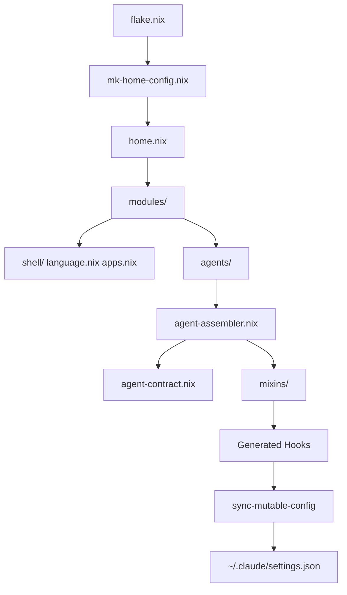

# How Nix Powers This

This page is for readers who are already comfortable with Nix basics — derivations, the store, `nix build` — but want to understand how this repository specifically uses those primitives. It covers five mechanisms: the flake as entry point, platform detection, the overlay convention, activation scripts for mutable config, and the module system as an IoC container for agent policy.

## The Flake as Entry Point

`flake.nix` is the single entry point for the entire repository. It declares three inputs:

- `nixpkgs` — the package collection, pinned to a specific commit via `flake.lock`
- `home-manager` — the user environment manager, follows the same nixpkgs
- `llm-agents` — a private flake providing `claude-code`, `gemini-cli`, `codex`, and `cli-proxy-api` as packages and an overlay

The flake's `outputs` function calls `lib/mk-home-config.nix` to produce `homeConfigurations` entries — one per platform and architecture combination. For NixOS hosts it also produces `nixosConfigurations`. There are no `devShells` or `packages` outputs that a downstream consumer would import; this is a leaf configuration, not a library.

```nix
# flake.nix (conceptual shape)
{
  inputs = {
    nixpkgs.url = "github:NixOS/nixpkgs/nixos-unstable";
    home-manager.url = "github:nix-community/home-manager";
    llm-agents.url = "github:vanillacake369/llm-agents";
  };

  outputs = { nixpkgs, home-manager, llm-agents, ... }:
    let
      builders = import ./lib/mk-home-config.nix { ... };
    in {
      homeConfigurations = {
        "hm-aarch64-darwin"    = builders.mkHomeConfig { ... };
        "hm-x86_64-darwin"     = builders.mkHomeConfig { ... };
        "hm-nixos-x86_64-linux" = builders.mkHomeConfig { isNixOs = true; ... };
        "hm-wsl-x86_64-linux"  = builders.mkHomeConfig { isWsl = true; ... };
        "hm-x86_64-linux"      = builders.mkHomeConfig { ... };
      };
    };
}
```

## Platform Detection

`lib/mk-home-config.nix` derives four boolean flags and threads them through `extraSpecialArgs` to every module in the configuration:

| Flag | Source |
|---|---|
| `isDarwin` | `pkgs.stdenv.isDarwin` |
| `isLinux` | `pkgs.stdenv.isLinux` |
| `isWsl` | Passed explicitly as `isWsl = true` in the flake output for WSL targets |
| `isNixOs` | Passed explicitly as `isNixOs = true` in the flake output for NixOS targets |

Modules receive these flags as function arguments and use `lib.optionals` for conditional package lists and `lib.mkIf` for conditional option blocks:

```nix
# Example usage inside a module
{ isDarwin, isLinux, lib, pkgs, ... }:
{
  home.packages = lib.optionals isDarwin [
    pkgs.aerospace      # macOS tiling window manager
  ] ++ lib.optionals isLinux [
    pkgs.hyprland       # Wayland compositor
  ];
}
```

The flags travel from `flake.nix` down through `extraSpecialArgs` without any module needing to detect the platform itself. Each module is a pure function of its inputs.

## The Overlay Convention

Any file named `*.overlay.nix` inside the `modules/` directory tree is automatically collected by `lib/discover-overlays.nix` and applied to nixpkgs. The `llm-agents` flake overlay is appended on top.

```nix
# flake.nix (excerpt)
collectOverlays = import ./lib/discover-overlays.nix { inherit lib; };
overlays = collectOverlays ./modules ++ [ llm-agents.overlays.default ];
```

This convention allows package pinning or patching to be co-located with the module that needs it. To pin terraform to a specific version, drop a `terraform.overlay.nix` file into `modules/` alongside the module that uses it. No modification to `flake.nix` is required. The overlay is picked up automatically on the next `nix build`.

Current overlays in the repository pin `terraform` to `1.5.2` (to protect state file format compatibility) and override `neovim` to a specific pre-release revision.

## Activation Scripts for Mutable Config

Several tools that this configuration manages — Claude Code, Gemini CLI, Codex — write runtime state back to their config files. OAuth tokens, project usage history, and auto-updated preferences all land in the same JSON file that Nix would otherwise own as a read-only symlink.

The standard home-manager approach (symlink everything from the Nix store) does not work for these files. A read-only symlink blocks the OAuth flow entirely.

`lib/sync-mutable-config.nix` provides two helpers:

**`mkJsonSync` (deep-merge)** — reads an existing file, deep-merges the Nix-generated content on top, and writes the result back. Used for Claude Code and Gemini settings, where the provider CLIs write keys that must be preserved across activations (OAuth tokens, project IDs, usage data).

**`mkFileCopy` (overwrite with backup)** — copies the generated file over the existing one, saving a timestamped backup first. Used for Codex's TOML config, where the file format does not lend itself to deep-merge and the runtime-written keys are less critical.

Both helpers run as `home.activation` scripts — after the Nix store generation, during the activation phase when writing to `$HOME` is permitted.

## The Module System as IoC Container

The agent policy contract system uses the Nix module system's dependency resolution as an inversion-of-control container. This is the same mechanism that makes `services.openssh.enable = true` automatically configure the SSH daemon without the user wiring anything together. The agent policy contract replicates that pattern for hook generation.

The flow works as follows:

1. **Provider modules** (e.g. `modules/agents/claude.nix`) set values on `agentPolicy.providers.claude.*` — the capability options defined in `lib/agent-policy/agent-contract.nix`.
2. **Mixin modules** (in `lib/agent-policy/mixins/`) each declare a dependency on `config.agentPolicy.providers` and write their output to `config.agentPolicy._hooks.<mixin>.<provider>`. They are passive: they run when imported, generate hooks only for providers where the relevant option is enabled, and write nothing else.
3. **`agent-hook-adapters.nix`** reads `config.agentPolicy._hooks` and converts the internal `{ event, matcher, script }` representation to each provider's native settings schema.
4. **`agent-assembler.nix`** is the assembler. It imports all mixins and the contract, maps the adapted hooks per provider, and writes the final result to `config.agentPolicy._assembledHooks`.
5. **Provider modules** read `config.agentPolicy._assembledHooks.<name>`, deep-merge with their base hooks, generate a Nix-store JSON file, and register an activation script to sync it into the live settings file.

No module explicitly calls another. The Nix module system evaluates all modules together, resolves the option graph, and produces a single consistent `config`. Adding a new mixin means importing it in `agent-assembler.nix`; the hook automatically appears in any provider that has the relevant option enabled.



The build-time assertions in `lib/agent-policy/agent-assertions.nix` run as part of normal `config.assertions` evaluation — the same mechanism used throughout nixpkgs to catch invalid option combinations. If an assertion fires, `nix build` stops with a message like:

```
error: Failed assertions:
- [AgentPolicy] strategyLint.enabled=true requires peerReviewProvider to be set for provider 'claude'
```

The message names the violated invariant and the provider. No hook script is generated. No settings file is written. The environment is consistent or it does not build.
